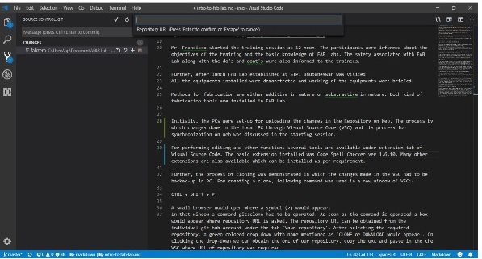

### Step to work with Github Repository

First Create an account on https://github.com/ with email id and other credentials and downloaded Visual Studio Code (VSC). Visual Source Code is required for the input through proper command which would be further hosted on account created on github.com.
For performing editing and other functions several tools are available under extension tab of Visual Source Code. The basic extension installed was Code Spell Checker ver 1.6.10. Many other extensions are also available which can be installed as per requirement.

Next the process of cloning was demonstrated in which the changes made in the VSC had to be backed-up in PC. For creating a clone, following command was used in a new window of VSC:-

CTRL + SHIFT + P

A small browser would open where a symbol (>) would appear. In that window a command git:clone has to be operated. As soon as the command is operated a box would appear where repository URL is asked. The snapshot is below.

The repository URL can be obtained from the individual git hub account under the tab 'Your repository'. After selecting the required repository, a green colored drop down with name mentioned as 'CLONE or DOWNLOAD would appear'. On clicking the drop-down we can obtain the URL of our repository. Copy the URL and paste in the the VSC where URL of repository was required.

Further, the system would ask to select a folder where cloning has to be done. On selecting the folder, a small window would pop-up asking to open the repository. The cloning of the changes done in local PC is now complete and further step by step process for uploading the same to web has been mentioned below.

The step-by-step process for synchronizing the local PC and web is as under:-

1. Any changes done or the text written in the VSC has to be saved by pressing CTRL+S.

2. Next the changes saved could be seen in the left side of the screen under source control. The symbol indicates the number of changes which are to be incorporated.

3. After that the changes to be done has to be provided with commit on each occasion the changes are done.

4. The changes are to be tick marked which is available at SOURCE CONTROL:GIT

5. The changes done are to be pushed to the web using 3 dots available in the same section.

While performing the above task a problem was encountered wherein VSC has given a error that ' please tell me who you are'. The error occurred since the email id and name of user has to be specified while synchronizing the local PC and web. VSC has also demonstrated the command which is used to be recognized which is,

- git config --global user.email "email id of user" 
- git config -- global username "name of user"

Once the command is operated , git would recognize the user on web and an email for the same would be sent to the registered email id.

- Note:- The practice of adding precise commit while pushing the data has to be undertaken as it would help the user to recognize the changes made. Git user id and password is required for making changes on web which is a one time process. 

6. After saving and pushing the data as mentioned above the same can be reviewed over web under the individual repository.

7. Next the uploading the images in the repository and wed was explored. During the execution error was found due to non- syncing of local PC and web. 

8. The system prompted to pull from the web prior to operating the push command. To resolve the issue, the changes made in the VSC were corrected so that sync with web can be achieved and further web and local repository was synced. Once the syncing process was done, the changes made were easily uploaded on web as well as on local machine.

Once the issue was resolve, the following command was used to upload the images & Link.

.